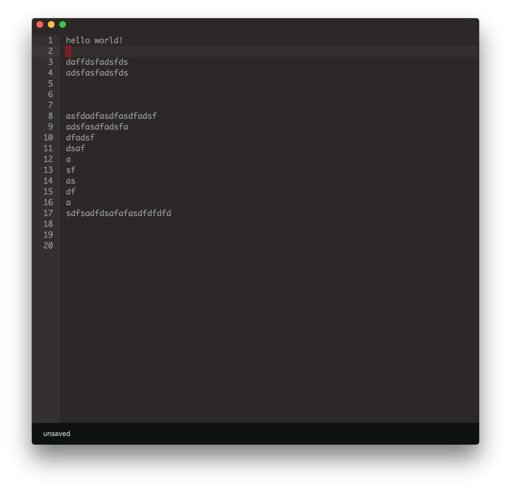

# text-crypt

minimal editor for pgp-encrypted text files.

## Development

1. Build the renderer: `yarn build:renderer:watch`
2. Start main process: `yarn start:dev`

## Screenshot

## License

[GNU GPLv3](LICENSE.md)
